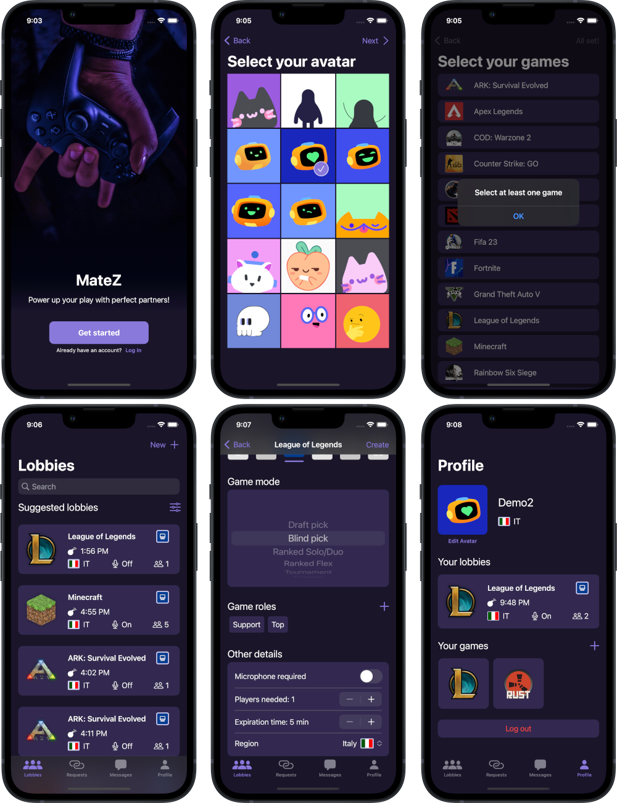

# MateZ iOS Client 🎮📱

MateZ is an iOS client for the MateZ platform — a lightweight social network built to help gamers connect, discover new players, and join lobbies that match their interests.

This app is developed in **SwiftUI**, uses **Swift 5 native concurrency**, and communicates through a **custom Web API**.
To use the client, you will need the MateZ Server, available in a separate repository.

---

## Features ✨

* 🔐 Account creation and authentication
* 👤 Player profile setup
* 🎮 Add and manage favourite games
* 🚀 Smooth onboarding experience
* 🧿 Optional FaceID / TouchID login
* 🔎 Browse, filter, and join game lobbies
* 💬 Experimental global chat

---

## Screenshots 🖼️

A preview of some UI screens from the app:

---

## Contributors 👥

* [Giada Pisani](https://github.com/giadapisani) — UI/UX design, custom assets
* Laura Bognanni — UI/UX design, custom assets
* [Aryan Garg](https://github.com/Aryan-garg-1) — Chat screen implementation
* [Giuseppe Rocco](https://github.com/iOmega8561) — iOS client development
